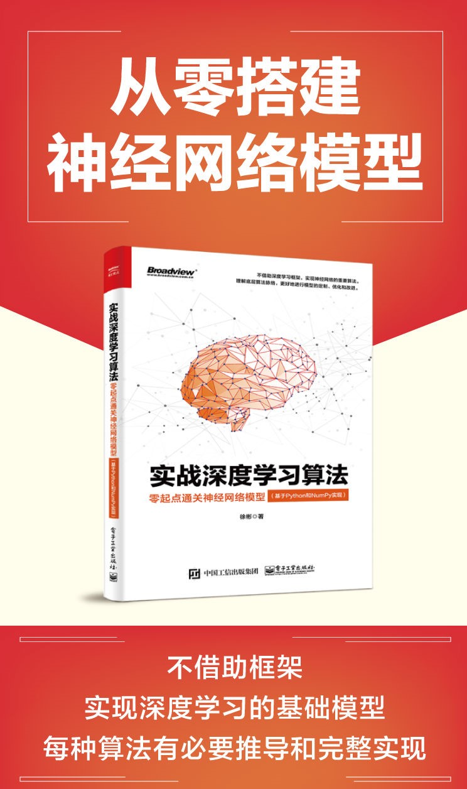
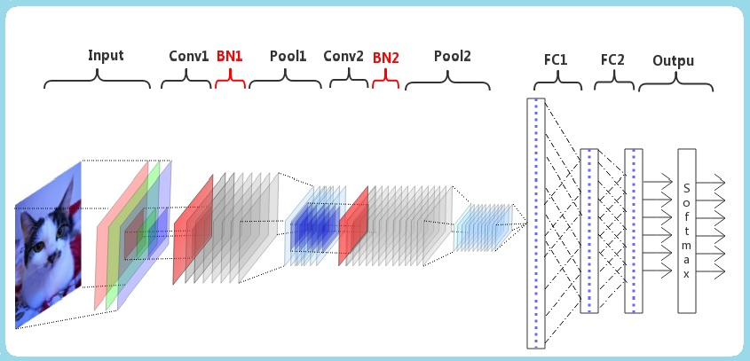
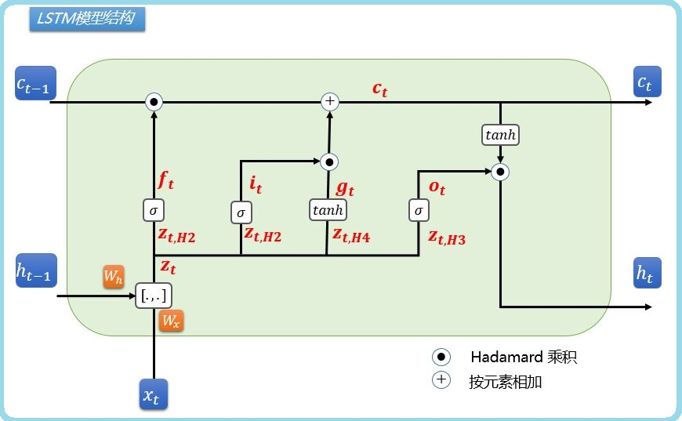
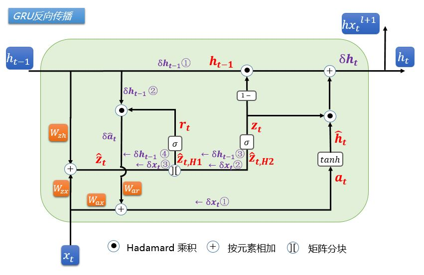

# 《实战深度学习算法：基于Python和Numpy实现》

#### 促销比价

##### 实体书

[电子工业出版社 天猫旗舰店](https://detail.tmall.com/item.htm?spm=a230r.1.14.23.bf1b5f08x4WeBr&id=602337867302&ns=1&abbucket=5 "电子工业出版社天猫旗舰店")

[京东图书](https://item.jd.com/12698534.html  "京东折扣")    [当当图书](http://product.dangdang.com/27943471.html  "当当")

#### 电子书

[亚马逊电子书]([https://www.amazon.cn/dp/B07ZJ5LD1C/ref=sr_1_1?__mk_zh_CN=%E4%BA%9A%E9%A9%AC%E9%80%8A%E7%BD%91%E7%AB%99&keywords=%E5%AE%9E%E6%88%98%E6%B7%B1%E5%BA%A6%E5%AD%A6%E4%B9%A0%E7%AE%97%E6%B3%95&qid=1586619079&sr=8-1](https://www.amazon.cn/dp/B07ZJ5LD1C/ref=sr_1_1?__mk_zh_CN=亚马逊网站&keywords=实战深度学习算法&qid=1586619079&sr=8-1)"kindle电子书")     [知乎电子书](https://www.zhihu.com/pub/book/119647254 "知乎电子书")

### 配套示例源码与数据下载说明。

不借助**深度学习框架**，零起点实现神经网络的重要算法。

正确使用模型和各种深度学习框架，离不开对原理的了解，如果对整体原理了然于胸，在应用深度学习框架的时候，可以避免陷入“盲人摸象”的窘境，看清全貌，直达本质，解决工程实践中遇到的问题。

### 内容组织

1. 提出问题。

2. 以问题为动机引出模型。

3. 介绍模型原理、必要推导和实例。

4. 实现模型算法。

5. 解决问题与验证。

   

### 各章目标问题和数据集

| 章   | 目标问题            | 模型、算法                                                   | 数据集                                                       |
| ---- | ------------------- | ------------------------------------------------------------ | ------------------------------------------------------------ |
| 1    | 空间中的二分类      | 感知机MLP、SGD                                               | 源码生成目标数据集，无需下载                                 |
| 2    | 多分类图像识别      | 全连接神经网络FCN、Softmax方法、信息熵与交叉熵、反向传播推导 | [MNIST手写数字识别](http://yann.lecun.com/exdb/mnist),1D方式载入 |
| 3    | 图像识别（acc>90%） | 深层全连接神经网络DNN、隐藏层、激活函数、过拟合与正则化、DNN的反向传播推导 | 同上、1D方式载入                                             |
| 4    | 图像识别            | 卷积神经网络CNN、卷积与互相关、边缘填充、最大池化与平均池化、CNN反向传播推导 | 同上、3D方式载入                                             |
| 5    | 图象识别            | CNN的提速与优化、向量化、Momentum、NAG、Adagrad、RMSprop、AdaDelta、Adam算法及实现 | 同上、3D方式载入                                             |
| 6    | 图象识别            | 批量规范化 Batch Norm动机、作用、训练、推理、反向传播推导    | 同上、3D方式载入                                             |
| 7    | 序列分析            | 循环神经网络RNN前向计算、反向传播推导                        | 源码生成目标数据集，无需下载                                 |
| 8    | 指数分析            | 长短时记忆网络LSTM前向计算、反向传播推导、梯度裁剪           | 选择1，原始数据，需要自行预处理：./data/沪深300历史数据.csv ； 选择2，预处理后数据，可直接用于训练和验证：./data/hs300_data_seq_nodate.csv |
| 9    | 情感分析            | 双向门控循环单元BiGRU前向计算、反向传播推导、Dropout正则化   | 选择1，原始数据，需自行预处理：[IMDB原始数据](http://ai.stanford.edu/~amaas/data/sentiment)、[nltk停用词表](http://www.nltk.org)、[50维40万英文词嵌入矩阵](https://nlp.stanford.edu/projects/glove)。 选择2，预处理后的词向量数据（一半数据量），可直接用于训练和验证。https://pan.baidu.com/s/1VZaUCceA6oEmkDaUB9oFJw 提取码 9xdu |

Batch Norm结构

LSTM结构

GRU结构

### 勘误

./勘误_实战深度学习算法.pdf	

### 欢迎交流

欢迎同行交流[知乎专栏](<https://www.zhihu.com/people/xu-jerry-82/posts>) ，可从公众号 **JerryX007Srv** 获得更新提醒。

